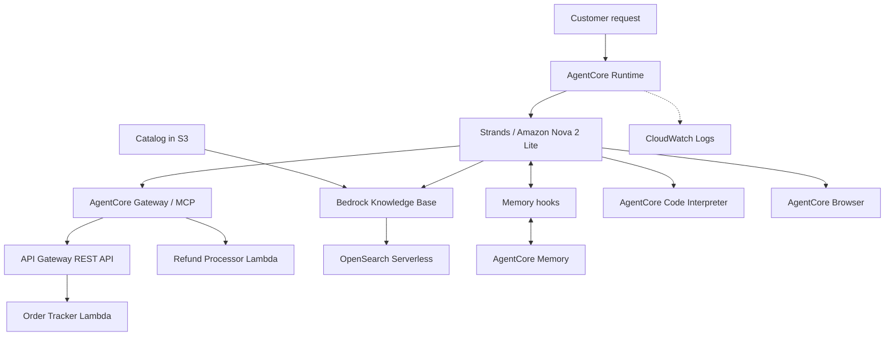

# AWS Architecture

[Project overview](README.md) · [Test evidence](TEST_EVIDENCE.md)

## Purpose and scope

This project gives an e-commerce customer one conversational interface for order
tracking, refunds, product and policy questions, loyalty calculations, and live
web browsing. AgentCore Runtime hosts the application; Strands coordinates the
model, tools, and customer memory.

The implementation follows the course's required integrations. The deployed
tests used `us-east-1`, Python 3.13, and Amazon Nova 2 Lite. Order and refund data
come from the course-provided Lambda fixtures.

## System design

## AWS services and their roles

| Service | Role in this project |
| --- | --- |
| AgentCore Runtime | Runs the asynchronous `@app.entrypoint` in [main.py](main.py) |
| Amazon Bedrock | Provides the Nova model and the Knowledge Base Retrieve API |
| AgentCore Gateway | Exposes REST API operations and a direct Lambda target as MCP tools |
| API Gateway and Lambda | Look up orders and customers, and return refund results |
| S3 and OpenSearch Serverless | Store the catalog source and its vector index |
| AgentCore Memory | Extracts customer facts and preferences for later sessions |
| AgentCore Code Interpreter | Executes the loyalty rules in a separate Python sandbox |
| AgentCore Browser | Opens a live website and retrieves page content |
| IAM and CloudWatch | Supply service permissions and runtime diagnostics |

## Request flow

1. The entrypoint validates the prompt and establishes customer and session IDs.
2. The application connects to the MCP Gateway and discovers its tools. The
   connection remains open while the assistant handles the request.
3. Memory hooks retrieve customer context, tag it by strategy, and prepend it to
   the user message before model invocation.
4. The assistant calls the appropriate tools. Response handling preserves the
   calculator's validated values and descriptive retrieval failures.
5. The completed exchange is saved through `create_event`; extraction and search
   indexing happen asynchronously. CloudWatch records discovery and memory saves.

## Integration details

### Orders and refunds

The order-tracking Lambda receives API Gateway proxy requests. Its REST routes
cover an individual order, a customer's orders, and a customer record. Each
operation has a unique name and a response schema for Gateway import. The refund
Lambda is a separate direct target, using [lambda_schema](lambda/lambda_schema).

The refund test exercises both target types in one conversation: it looks up
`ORD-002` through the API target, then invokes the refund Lambda. A failed Gateway
connection stops the request with `GATEWAY_UNAVAILABLE` and recovery guidance.

### Knowledge retrieval

[product_catalog.txt](product_catalog.txt) is uploaded to S3 and synced to a
Bedrock Knowledge Base using Titan Embeddings v2 and OpenSearch Serverless.
`search_knowledge_base` calls Retrieve and joins the returned text chunks into a
single response. Its docstring directs product and policy questions to this tool.
An empty `KB_ID` produces a descriptive configuration message.

### Customer memory

The course setup uses semantic facts and user preferences, with namespaces
`cs_agent/{actorId}/facts` and `cs_agent/{actorId}/preferences`. `get_namespaces`
reads the resource's strategy templates, including the legacy field format.
`MemoryHook` retrieves across those strategies before a turn and saves the final
user/assistant exchange afterward. Cross-session recall keeps the customer ID
fixed while changing the session ID.

### Calculations and browsing

The calculator sends a complete Python program to Code Interpreter with
`clearContext=True`. It uses Decimal rounding, 500-point redemption blocks, a
50% redemption cap, and a tier discount on the remaining balance. Pydantic
validates the structured output. A sandbox failure returns a tier-only estimate
without redeeming points. Calculations are quotes and do not update a ledger.

`AgentCoreBrowser` is initialized with the AWS region and added to the tool list.
The required browser test navigates to Udacity and reads its live page title.

## Configuration and deployment

Provide `REGION`, `GATEWAY_URL`, `KB_ID`, and the generated `MEMORY_ID` through
[config.json](config.json) or the supported environment variables. Use the
standard AWS credential chain for credentials. The execution role needs model,
retrieval, memory, sandbox, browser, and logging permissions.

The project uses the Python `bedrock-agentcore-starter-toolkit` CLI: configure,
deploy, invoke, and destroy. Install that toolkit alone to avoid conflicting
`agentcore` executables. Disable toolkit-managed memory creation because the
application uses the configured resource through its own hooks.

## Account choice, cleanup, and production

The course prescribes its temporary sandbox. Vector-store provisioning was
blocked there by `aoss:CreateSecurityPolicy`, so the complete test run used the
authorized personal account. No sandbox permissions were changed. All temporary
resources were removed afterward; the configuration now contains blank values.

The course's `NONE` Gateway authorizer is intended for temporary educational use.
A production service would need authenticated customer identity, order-ownership
checks, idempotent refunds, and memory retention and deletion controls. See the
[reflection](REFLECTION.md) for the design tradeoffs and testing challenge.

## Course references

The Project Overview, AWS Sign In and Costs, Environment Setup, Instructions,
and Project Rubric pages were reviewed on September 18, 2026. The scope and
evidence follow the [project overview](https://learn.udacity.com/nd905?version=1.2.15&partKey=cd14763&lessonKey=a8232740-a1b6-44ab-8e7f-d98b5960092f&conceptKey=7fec1ed1-cc4f-46bf-a020-ee27efe205b4)
and [rubric](https://learn.udacity.com/nd905?version=1.2.15&partKey=cd14763&lessonKey=a8232740-a1b6-44ab-8e7f-d98b5960092f&project=rubric).
These links require course access.
