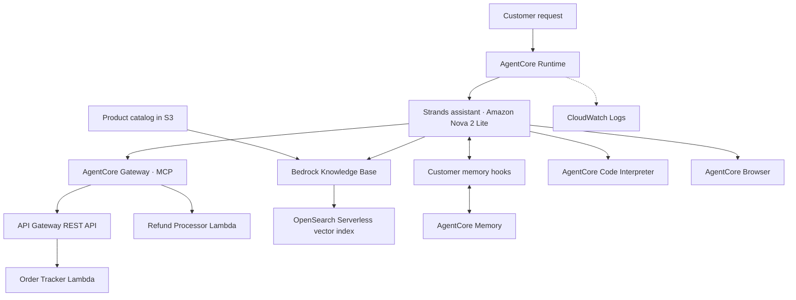

# Customer Support Assistant

[](requirements.txt) [](#architecture) [](#test-results) [](#project-status) [](submission/outputs/cleanup_verification.json) [](LICENSE)

A customer support assistant for Udacity Assignment 02, built with Python,
Strands, and Amazon Bedrock AgentCore. It connects a single conversation to order
tracking, refunds, catalog policies, customer memory, loyalty calculations, and
live website navigation.

This repository contains the completed implementation, the course's Lambda
resources, and the recorded deployment results needed to review the assignment.

## About

The project explores how a support assistant can use several AWS services while
keeping each service responsible for a specific task. Order and refund requests
go through the MCP Gateway. Policy answers come from the Knowledge Base. Customer
preferences are retrieved through memory hooks, and discount arithmetic runs in
Code Interpreter.

The main engineering concern is the answer the customer receives: tool results
must survive the final response, configuration failures must be understandable,
and customer context must remain associated with the correct customer and session.

## Project status

| Area | Status |
| --- | --- |
| Required implementation | Completed in [main.py](main.py) |
| Live deployment tests | All six scenarios passed on September 18, 2026, India time |
| Reviewer corrections | Missing-KB guard and Gateway failure handling verified on the deployed runtime |
| Deployment resources | Removed after evidence capture; configuration is a blank template |
| Udacity re-review | Pending; the revised submission has not been uploaded to the portal |

The test badge describes the recorded deployment run. It is not a continuous
integration check or a currently running service. The UTC timestamps in the
records are September 17, 2026.

## Architecture



### How a request is handled

1. The runtime validates the prompt and establishes the customer and session IDs.
2. The application discovers the Gateway tools and keeps the MCP connection open
   for the full turn.
3. Memory hooks add relevant customer facts and preferences to the context before
   the assistant selects and calls the tools needed for the request.
4. The final response preserves verified calculator values and descriptive
   retrieval failures. The completed exchange is saved to AgentCore Memory.
5. Runtime logs record Gateway discovery, connection errors, and memory saves.

### Components

| Component | Responsibility |
| --- | --- |
| Strands and Amazon Nova 2 Lite | Conversation handling and tool selection |
| AgentCore Runtime | Hosted asynchronous application entrypoint |
| MCP Gateway | Order API and refund Lambda tool discovery and invocation |
| Bedrock Knowledge Base | Retrieval of catalog facts, policies, and loyalty benefits |
| AgentCore Memory | Customer facts and preferences across separate sessions |
| Code Interpreter | Loyalty calculations using Decimal and explicit rounding |
| AgentCore Browser | Navigation and extraction of live page content |
| CloudWatch Logs | Runtime diagnostics and reviewer failure-test evidence |

## Implementation decisions

- **Keep financial values consistent.** Points are redeemed in 500-point blocks,
  capped at half the order value. The tier discount applies to the balance after
  redemption. The final reply preserves the calculator's structured output.
- **Make configuration errors useful.** A missing Knowledge Base ID produces an
  explicit setup message. A failed Gateway connection returns retry instructions
  and administrator guidance, with diagnostic details in the runtime logs.
- **Allow for asynchronous memory.** A new session uses the same customer ID but
  a different session ID. Extraction and indexing need time before recall succeeds.
- **Keep fallback behavior explicit.** If Code Interpreter is unavailable, the
  assistant returns a tier-only estimate without redeeming customer points.

The [engineering reflection](REFLECTION.md) discusses the arithmetic discrepancy
found during live testing and the controls needed before production use.

## Repository contents

```text
main.py                         Runtime, tools, memory hooks, and response handling
config.json                     AWS configuration template
requirements.txt                Pinned runtime dependencies
product_catalog.txt             Knowledge Base source content
lambda/                         Starter order/refund functions and Gateway schema
submission/outputs/             Runtime conversations, CLI output, and correction checks
submission/screenshots/         Outcome panels and AWS runtime status
REFLECTION.md                   Course reflection
LICENSE                         MIT license
```

## Setup and deployment

### Prerequisites

- Python 3.13, AWS CLI, and AWS credentials for the selected course account.
- Access to the required Bedrock model and permissions for the course resources.
- The course Environment Setup completed in `us-east-1`: Lambda functions,
  REST API, MCP Gateway, Knowledge Base, and AgentCore Memory.

### Install dependencies

```powershell
git clone https://github.com/Nitin-Mane/AI-Support-Agent.git
cd AI-Support-Agent
python -m venv .venv
.venv\Scripts\python.exe -m pip install -r requirements.txt
.venv\Scripts\python.exe -m pip install bedrock-agentcore-starter-toolkit==0.3.12
```

### Configure AWS resources

Sync [product_catalog.txt](product_catalog.txt) to the Knowledge Base, then fill
in [config.json](config.json):

```json
{
  "REGION": "us-east-1",
  "GATEWAY_URL": "<gateway-mcp-url>",
  "KB_ID": "<knowledge-base-id>",
  "MEMORY_ID": "<generated-memory-id>"
}
```

Use the generated Memory ID rather than its display name. `AWS_REGION`,
`GATEWAY_URL`, `KB_ID`, and `MEMORY_ID` environment variables can override these
settings. Credentials belong in the AWS credential chain, outside this file.

Stage `main.py`, `requirements.txt`, and the completed `config.json` in a separate
deployment directory. Activate the environment and run
`agentcore configure --entrypoint main.py` there, selecting the course's Python
3.13 deployment settings, region, execution role, and source bucket. Then run
`agentcore deploy`.

The execution role needs access to model invocation, Knowledge Base retrieval,
memory retrieval and event creation, Code Interpreter, Browser, and runtime logs.
Gateway API methods need response schemas before their OpenAPI definitions can
be imported. The recorded deployment used application-managed memory hooks and
ordinary CloudWatch logging.

Disable toolkit-managed memory creation when configuring the deployment: the
application already uses the memory resource supplied through `MEMORY_ID`.

### Invoke the deployed assistant

Example for a Bash terminal with the deployment environment active:

```bash
agentcore invoke '{"prompt":"Can you track order ORD-001?","customer_id":"CUST-123","session_id":"t1"}'
```

Run all six course scenarios against the deployed runtime. For the memory test,
keep the customer ID unchanged, use distinct session IDs, and wait at least
30 seconds between the introduction and recall requests; indexing may take longer.

## Test results

All six positive scenarios used version 1 of the same deployed runtime in
`us-east-1`. The JSON records include requests, responses, tool conversations,
runtime identifiers, and timestamps.

| Required test | Recorded result | Conversation | Screenshot |
| --- | --- | --- | --- |
| 1. Order tracking | SHIPPED; UPS; TRK987654321 | [Order](submission/outputs/order.json) | [Panel](submission/screenshots/01_order.jpg) |
| 2. Refund | Valid API and Lambda responses; APPROVED; $139.99; 3–5 business days | [Refund](submission/outputs/refund.json) | [Panel](submission/screenshots/02_refund.jpg) |
| 3. RAG | Platinum: free same-day shipping, 15% discount, priority support | [Retrieval](submission/outputs/rag.json) | [Panel](submission/screenshots/03_rag.jpg) |
| 4. Memory | Recalls Jane and her preference for concise replies in a new session | [A](submission/outputs/memory_a.json), [B](submission/outputs/memory_b.json) | [A](submission/screenshots/04_memory_a.jpg), [B](submission/screenshots/04_memory_b.jpg) |
| 5. Loyalty discount | 4,000 points redeemed; 10% Gold discount; $99 total; 349 points remaining | [Calculation](submission/outputs/discount.json) | [Panel](submission/screenshots/05_discount.jpg) |
| 6. Browser | Retrieved the live Udacity page title | [Browser](submission/outputs/browser.json) | [Panel](submission/screenshots/06_browser.jpg) |

The outcome panels display saved runtime responses and contain no cursor. The
[runtime status image](submission/screenshots/runtime_ready.jpg) is an AWS console
crop. The [source check](submission/outputs/source_verification.json) confirms that
the uploaded `main.py` matches the implementation in this repository.

Actual `agentcore invoke` terminal output is included for
[order tracking](submission/outputs/agentcore_invoke.txt) and
[RAG](submission/outputs/agentcore_rag.txt). Their
[order metadata](submission/outputs/agentcore_invoke.json) and
[RAG metadata](submission/outputs/agentcore_rag.json) record exit code 0.

### Reviewer corrections and test observations

The deployed [missing-KB check](submission/outputs/rag_guard.json) returned the
required descriptive message. The [dummy Gateway check](submission/outputs/gateway_failure.json)
returned `GATEWAY_UNAVAILABLE` with recovery guidance.
[CloudWatch records](submission/outputs/runtime_logs.json) include successful
discovery and the connection failure.

The [initial memory recall](submission/outputs/memory_b_initial.json) preceded
successful indexing and did not retrieve the customer context. The later recall
succeeded. The browser also recovered from one invalid session name before
reading the live title. These observations remain visible in the saved records.

## Account choice and cleanup

The course specifies the Udacity sandbox. That account denied
`aoss:CreateSecurityPolicy`, which blocked vector-store provisioning. The complete
test run therefore used the authorized personal AWS account. This is a departure
from the sandbox setup instruction; no sandbox IAM permissions were changed.

Temporary deployment resources were removed after testing, with
[20 recorded absence checks](submission/outputs/cleanup_verification.json).
The resource IDs in the evidence describe that completed run. New resources and
configuration values are needed to redeploy.

## Production considerations

This is a coursework implementation using starter order and refund fixtures.
Before connecting it to real customer accounts, the service would need verified
customer identity, order-ownership checks, idempotent refund handling, and memory
retention and deletion controls. Discount calculations are quotes; they do not
update a customer points ledger.

## License

Licensed under the [MIT License](LICENSE). The course-provided Lambda resources
are retained unchanged.
