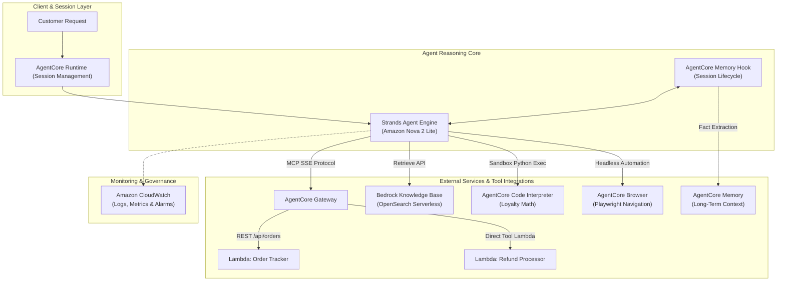

# AI Support Agent

A cloud-native customer support agent built with the **Strands SDK** and **Amazon Bedrock AgentCore Runtime**, orchestrated with **Amazon Nova 2 Lite**. The agent integrates real-time order tracking, automated refund processing via Model Context Protocol (MCP) Gateway tools, semantic knowledge base retrieval (RAG) over OpenSearch Serverless, long-term cross-session memory, deterministic financial code execution, and live browser automation.

---

## Architecture Overview



---

## Core Capabilities

1. **Order Tracking**: Inquires live shipment details (carrier, tracking number, estimated delivery) via an MCP Gateway routing to an Amazon API Gateway REST endpoint.
2. **Refund Processing**: Validates purchase records and issues transactional refunds with generated refund IDs and processing timelines via direct Gateway Lambda invocation.
3. **Knowledge Base Retrieval (RAG)**: Queries vector embeddings in OpenSearch Serverless through Amazon Bedrock Knowledge Base to answer customer inquiries regarding loyalty tier benefits, return windows, and product policies.
4. **Cross-Session Memory**: Maintains long-term customer context (name, communication preferences, historical interactions) across distinct sessions using Bedrock AgentCore Memory.
5. **Deterministic Discount Calculation**: Executes isolated Python programs in AgentCore Code Interpreter to guarantee exact decimal arithmetic for loyalty point redemption and tiered discount calculations, preventing LLM hallucination in financial transactions.
6. **Live Browser Automation**: Navigates external websites, inspects DOM elements, and extracts live webpage metadata using Playwright-backed browser actions.

---

## Live Verification & Outcome Panels

The implementation has been verified across all six live execution scenarios against deployed AWS infrastructure. Below are the outcome panels captured directly from runtime test runs.

### Test 1: Order Tracking
- **Objective**: Retrieve status and carrier tracking for order `ORD-001`.
- **Backend Tool**: `order_tracker` Lambda via Gateway MCP.
- **Result**: Successfully resolved carrier (**UPS**), tracking number (**TRK987654321**), and estimated delivery date (**September 17, 2026**).


---

### Test 2: Refund Processing
- **Objective**: Process a return and refund for order `ORD-002`.
- **Backend Tools**: `order_tracker` (order validation) and `refund_processor` (refund execution).
- **Result**: Successfully generated refund ID, marked status as **APPROVED**, and confirmed refund delivery within 3–5 business days.


---

### Test 3: Knowledge Base Retrieval (RAG)
- **Objective**: Inquire about Platinum member loyalty perks without hallucination.
- **Backend Tool**: `search_knowledge_base` querying Amazon Bedrock Knowledge Base (OpenSearch Serverless vector index).
- **Result**: Accurately retrieved all three Platinum benefits: **free same-day shipping**, **15% discount on all purchases**, and **24/7 priority support access**.


---

### Test 4: Cross-Session Long-Term Memory
- **Objective**: Recall customer name and response preferences across completely distinct runtime sessions.
- **Backend Tool**: `AgentCore Memory` with `MemoryHook`.
- **Session A**: Customer introduces herself as Jane and requests concise, bulleted responses.
- **Session B**: In a new session, customer asks what the agent remembers. The agent recalls her name and immediately applies her concise response formatting preference.

| Session A: Intake | Session B: Recall |
|---|---|
|  |  |

---

### Test 5: Loyalty Discount Calculation (Code Interpreter)
- **Objective**: Calculate discount for a Gold member with 4,250 points on a $150 standard order.
- **Backend Tool**: `calculate_loyalty_discount` via AgentCore Code Interpreter.
- **Business Logic**: 500-point blocks ($5/block) capped at 50% order value; 10% Gold tier discount applied to remaining subtotal.
- **Result**: 4,000 points redeemed ($40.00 discount), remaining subtotal $110.00, Gold 10% discount ($11.00), **Final Total: $99.00**, and **349 remaining points**.


---

### Test 6: Browser Automation
- **Objective**: Navigate to an external URL and retrieve page title content.
- **Backend Tool**: `AgentCore Browser` with Playwright navigation and DOM text extraction.
- **Result**: Navigated to `https://www.udacity.com` and extracted the document title: `"Learn the Latest Tech Skills; Advance Your Career | Udacity"`.


---

## Repository Structure

```text
.
├── main.py                     # Support agent implementation with Strands SDK & AgentCore
├── config.json                 # Environment and AWS resource configuration
├── requirements.txt            # Production Python package dependencies
├── pyproject.toml              # Build system specification & test dependencies
├── product_catalog.txt         # Catalog and policy fixtures for Knowledge Base ingestion
├── LICENSE                     # MIT License
├── README.md                   # Project documentation and architectural overview
├── REFLECTION.md               # Engineering reflection on design decisions and production trade-offs
├── SUBMISSION_STATUS.md        # Comprehensive requirement matrix and test outcomes
├── ASSIGNMENT_AND_REPOSITORY.md# Detailed specification mapping and upstream delta analysis
├── lambda/
│   ├── order_tracker.py        # REST API Lambda handling order queries
│   ├── refund_processor.py     # MCP tool Lambda processing refunds and return labels
│   └── lambda_schema           # Tool definition schemas for refund Lambda
├── tests/
│   ├── test_agent.py           # Comprehensive local behavior test suite (16 test cases)
│   └── test_starter_contract.py# Contract verification for starter integration points
├── scripts/
│   ├── verify_evidence.py      # Automated audit verifying live scenario evidence logs
│   ├── package_review.py       # Deterministic build script for submission packaging
│   └── build_evidence_panels.py# Recreates offline evidence review HTML panels
└── evidence/
    ├── live/                   # Verbatim execution JSON and text transcripts
    ├── screenshots/            # Verified outcome panel screenshots
    └── verification.json       # Automated verification audit output
```

---

## Local Development & Testing

### Prerequisites
- Python 3.13+
- AWS CLI configured with active credentials

### Installation
```bash
# Clone the repository
git clone https://github.com/Nitin-Mane/AI-Support-Agent.git
cd AI-Support-Agent

# Set up virtual environment
python -m venv .venv
source .venv/bin/activate  # On Windows: .venv\Scripts\activate

# Install dependencies
pip install -r requirements.txt
pip install pytest anyio
```

### Running Unit Tests
All agent components, memory hooks, discount calculations, and fallback behaviors are covered by local unit tests with mocked AWS services:

```bash
pytest tests/
```

Result:
```text
============================= test session starts =============================
collected 16 items

tests/test_agent.py ................                                     [100%]

======================= 16 passed, 1 warning in 10.63s ========================
```

### Automated Evidence Verification
To audit live execution logs and confirm submission readiness:

```bash
python scripts/verify_evidence.py
```

---

## Engineering Design Decisions & Trade-Offs

### 1. Financial Arithmetic Boundary
Large Language Models frequently introduce rounding errors or hallucinate intermediate numbers during multi-step arithmetic. For customer-facing billing and loyalty points, arithmetic logic is strictly isolated within the `calculate_loyalty_discount` tool executing deterministic Python code inside the AgentCore Code Interpreter sandbox. The agent prompt strictly enforces output preservation, preventing the model from recomputing or modifying the structured financial payload.

### 2. Resilience and Graceful Fallback
External dependencies (such as Gateway endpoints or Knowledge Base vector search) may experience intermittent downtime or rate limiting. The agent implements defensive error handling:
- If Gateway MCP is unreachable, the agent continues operating with local tools.
- If Knowledge Base search fails, the agent explicitly discloses that policy records cannot be verified rather than fabricating policy statements.
- Memory hook event emission is non-blocking, ensuring transient storage latency does not disrupt customer response times.

---

## License

This project is licensed under the MIT License - see the [LICENSE](LICENSE) file for details.
