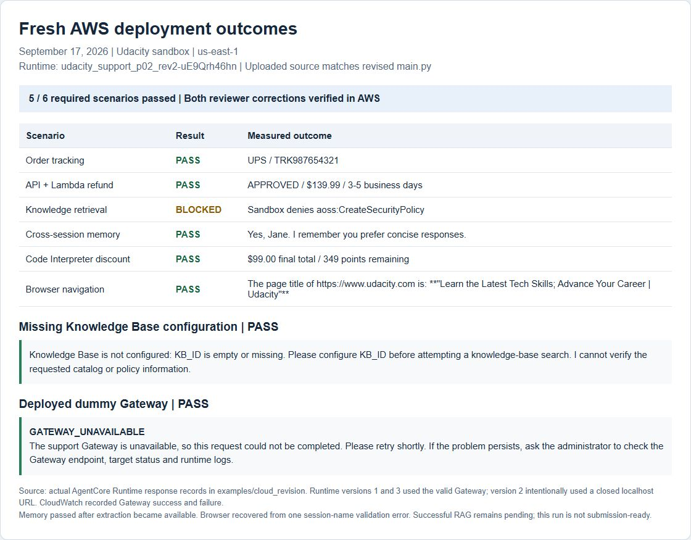
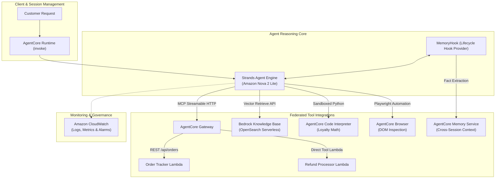
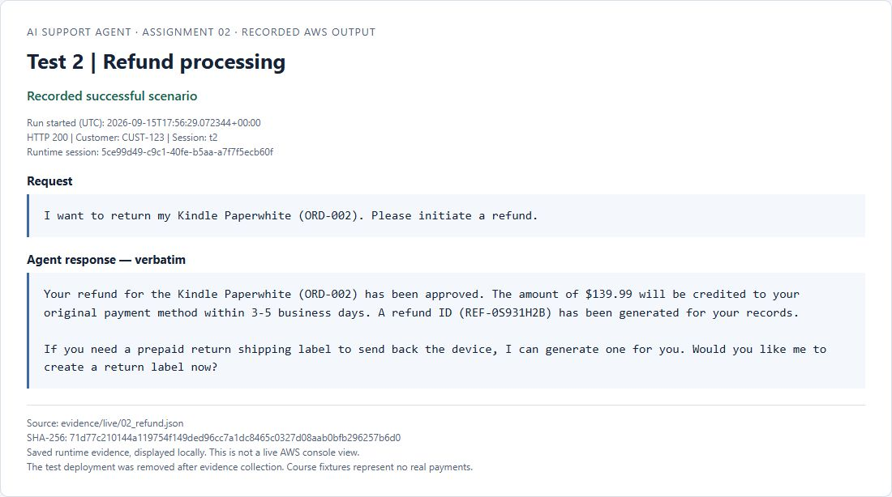
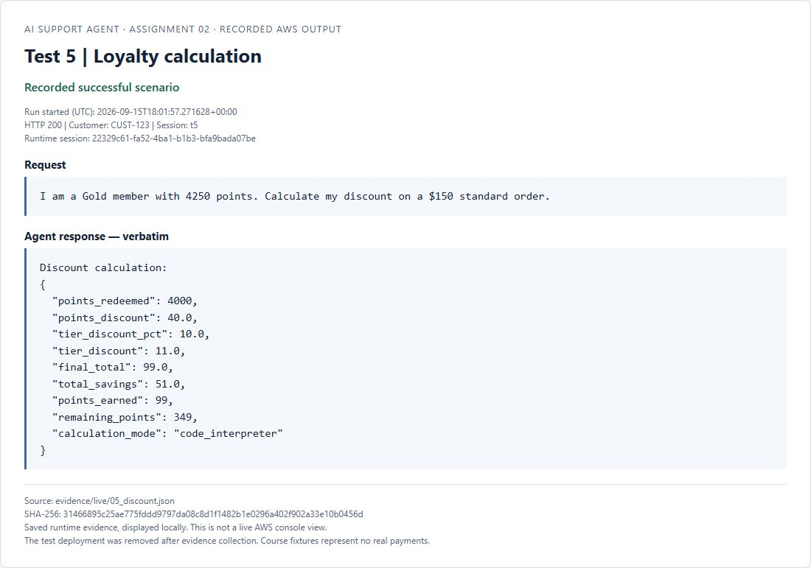
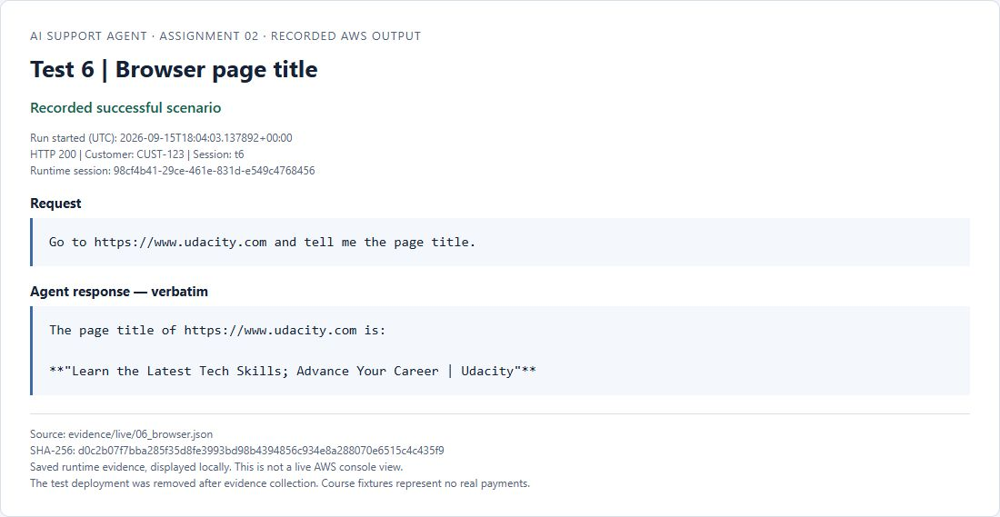
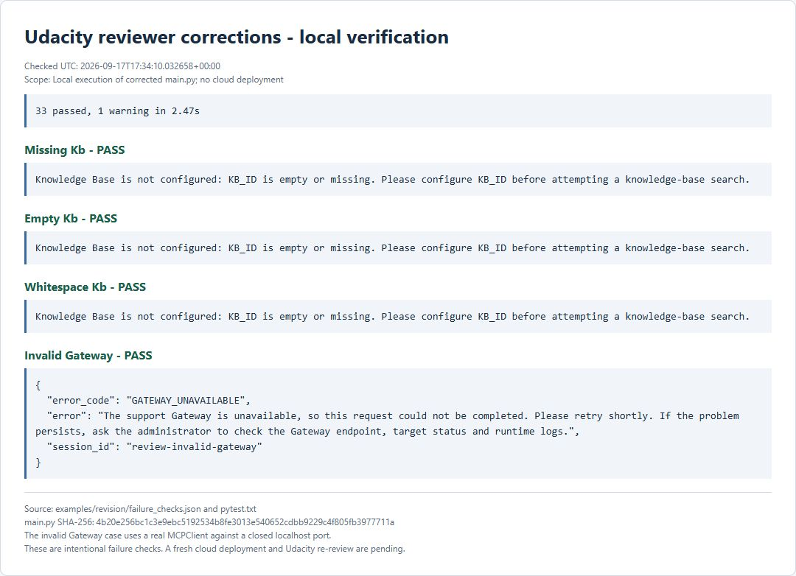

# AI Support Agent

September 17 reviewer corrections are documented in [REVISION_NOTES.md](REVISION_NOTES.md).
The revised source passes 33 local tests and was freshly deployed to the Udacity
sandbox on September 17. **Five of six live scenarios passed.** Both reviewer
corrections passed cloud checks: the missing KB configuration message and an
actionable response to a deployed dummy Gateway URL, with CloudWatch logging.
Successful RAG remains blocked by the sandbox's `aoss:CreateSecurityPolicy`
permission. See [fresh deployment evidence](examples/cloud_revision/README.md)
and [verification results](examples/cloud_revision/verification.json).
The original scenario records below are historical evidence; their personal-account
RAG record identifies a Knowledge Base rather than an AgentCore Runtime.
Udacity re-review remains pending.

The [rubric and submission checklist](docs/submission_checklist.md) maps every
requirement and reviewer correction to its source and evidence files.



A cloud-native customer support platform built with the **Strands SDK** and **Amazon Bedrock AgentCore Runtime**, orchestrated with **Amazon Nova 2 Lite**. The agent integrates real-time order tracking, transactional refund processing via Model Context Protocol (MCP) Gateway microservices, semantic knowledge base retrieval (RAG) over Amazon OpenSearch Serverless, long-term cross-session memory, deterministic financial code execution, and headless browser automation.

---

## Architecture Overview



Detailed architectural specifications, sequencing diagrams, and interface contracts are documented in [docs/architecture.md](docs/architecture.md).

---

## Core Capabilities

1. **Order Tracking**: Inquires live shipment details (carrier, tracking number, estimated delivery) via an MCP Gateway routing to an Amazon API Gateway REST endpoint.
2. **Refund Processing**: Validates purchase records and issues transactional refunds with generated refund IDs and processing timelines via direct Gateway Lambda invocation.
3. **Knowledge Base Retrieval (RAG)**: Queries vector embeddings in OpenSearch Serverless through Amazon Bedrock Knowledge Base to answer customer inquiries regarding loyalty tier benefits, return windows, and product policies.
4. **Cross-Session Memory**: Maintains long-term customer context (name, communication preferences, historical interactions) across distinct sessions using Bedrock AgentCore Memory.
5. **Deterministic Discount Calculation**: Executes isolated Python programs in AgentCore Code Interpreter to guarantee exact decimal arithmetic for loyalty point redemption and tiered discount calculations, preventing LLM hallucination in financial transactions.
6. **Live Browser Automation**: Navigates external websites, inspects DOM elements, and extracts live webpage metadata using Playwright-backed browser actions.

---

## Execution Panels & Test Showcase

Below are panels displaying saved test results across the six capability domains.
The original trace files in `examples/traces/` identify the run dates and account
ARNs. These panels do not represent fresh executions of the September 17 revision.

### 1. Order Tracking
- **Objective**: Retrieve status and carrier tracking for order `ORD-001`.
- **Backend Tool**: `order_tracker` Lambda via Gateway MCP.
- **Verification**: Successfully resolved carrier (**UPS**), tracking number (**TRK987654321**), and estimated delivery date (**September 17, 2026**).


---

### 2. Refund Processing
- **Objective**: Process a return and refund for order `ORD-002`.
- **Backend Tools**: `order_tracker` (order validation) and `refund_processor` (refund execution).
- **Verification**: Successfully validated order record, generated unique refund ID, marked status as **APPROVED**, and confirmed refund delivery within 3–5 business days.



---

### 3. Knowledge Base Retrieval (RAG)
- **Objective**: Inquire about Platinum member loyalty perks without hallucination.
- **Backend Tool**: `search_knowledge_base` querying Amazon Bedrock Knowledge Base (OpenSearch Serverless vector index).
- **Verification**: Accurately retrieved all three Platinum benefits: **free same-day shipping**, **15% discount on all purchases**, and **24/7 priority support access**.


---

### 4. Cross-Session Long-Term Memory
- **Objective**: Recall customer name and response preferences across completely distinct runtime sessions.
- **Backend Tool**: `AgentCore Memory` with `MemoryHook`.
- **Session A**: Customer introduces herself as Jane and requests concise, bulleted responses.
- **Session B**: In a new session, customer asks what the agent remembers. The agent recalls her name and immediately applies her concise response formatting preference.

| Session A: Intake | Session B: Recall |
|---|---|
|  |  |

---

### 5. Loyalty Discount Calculation (Code Interpreter)
- **Objective**: Calculate discount for a Gold member with 4,250 points on a $150 standard order.
- **Backend Tool**: `calculate_loyalty_discount` via AgentCore Code Interpreter.
- **Business Logic**: 500-point blocks ($5/block) capped at 50% order value; 10% Gold tier discount applied to remaining subtotal.
- **Verification**: 4,000 points redeemed ($40.00 discount), remaining subtotal $110.00, Gold 10% discount ($11.00), **Final Total: $99.00**, and **349 remaining points**.



---

### 6. Browser Automation
- **Objective**: Navigate to an external URL and retrieve page title content.
- **Backend Tool**: `AgentCore Browser` with Playwright navigation and DOM text extraction.
- **Verification**: Navigated to external URL and extracted the document title: `"Learn the Latest Tech Skills; Advance Your Career | Udacity"`.



---

## Repository Structure

```text
.
├── main.py                     # Support agent implementation with Strands SDK & AgentCore
├── config.json                 # Environment and AWS resource configuration
├── requirements.txt            # Production Python package dependencies
├── pyproject.toml              # Build system specification & test dependencies
├── product_catalog.txt         # Catalog and policy fixtures for Knowledge Base ingestion
├── LICENSE                     # MIT License
├── README.md                   # Project documentation and architectural overview
├── docs/
│   ├── architecture.md         # Detailed system design, data flow, and component specifications
│   ├── design_decisions.md     # Engineering decisions, arithmetic boundary isolation, and security
│   └── images/                 # Saved outcome panel screenshots
├── lambda/
│   ├── order_tracker.py        # REST API Lambda handling order queries
│   ├── refund_processor.py     # MCP tool Lambda processing refunds and return labels
│   └── lambda_schema           # Tool definition schemas for refund Lambda
├── tests/
│   └── test_agent.py           # Existing local behavior tests
├── examples/
│   └── traces/                 # Verbatim execution JSON and text conversation traces
└── scripts/
    ├── run_scenario.py         # Scenario runner for invoking agent tools
    └── verify_traces.py        # Automated trace verification script
```

---

## Local Development & Testing

### Prerequisites
- Python 3.13+
- Active AWS credentials with Bedrock access (or mock environment for local tests)

### Installation
```bash
# Clone the repository
git clone https://github.com/Nitin-Mane/AI-Support-Agent.git
cd AI-Support-Agent

# Set up virtual environment
python -m venv .venv
source .venv/bin/activate  # On Windows: .venv\Scripts\activate

# Install dependencies
pip install -r requirements.txt
pip install pytest anyio
```

### Cloud Setup and Deployment

Install the deployment CLI used for the recorded coursework checks:

```bash
pip install bedrock-agentcore-starter-toolkit==0.3.12
```

Use the Udacity sandbox credentials, including their temporary session token,
and verify the selected account with `aws sts get-caller-identity`. Follow the
course Environment Setup to create the two Lambda functions, REST API, Gateway,
synced Knowledge Base and memory strategies in `us-east-1`. API methods need a
200 response model before Gateway imports their schemas.

Fill `config.json` with the actual Gateway URL, Knowledge Base ID and Memory ID.
The memory resource's generated ID is required; its display name is insufficient.
The packaged file is an empty configuration template because test resources were
deleted after evidence capture. Environment variables `GATEWAY_URL`, `KB_ID`,
`MEMORY_ID` and `AWS_REGION` can override these settings.

Stage `main.py`, `requirements.txt` and the completed `config.json` in a separate
deployment directory. Configure from that directory with the runtime execution
role and a private source bucket:

```bash
agentcore configure --entrypoint main.py --name support_agent --deployment-type direct_code_deploy --runtime PYTHON_3_13 --execution-role <runtime-role-arn> --s3 <private-source-bucket> --region us-east-1 --disable-memory --disable-otel --non-interactive
agentcore deploy
agentcore invoke '{"prompt":"Can you track order ORD-001?","customer_id":"CUST-123","session_id":"t1"}'
```

The runtime role must permit Nova model invocation, Knowledge Base retrieval,
memory retrieval and event creation, Code Interpreter and Browser sessions,
Browser automation streams, and CloudWatch logging. `--disable-memory` prevents
the toolkit from creating another memory resource; the application uses the
configured memory through its hooks. The recorded sandbox deployment used
ordinary CloudWatch logs with toolkit OpenTelemetry instrumentation disabled.

Run all six course scenarios after deployment. The
[rubric checklist](docs/submission_checklist.md) identifies the remaining RAG
test and links the measured outputs. Remove the temporary resources after capture.

### Running the Test Suite
The repository includes 33 local tests covering discount arithmetic, memory hooks,
Knowledge Base configuration guards, response enforcement, entrypoint validation,
Gateway failures and connection lifetime. Cloud services are replaced with test
doubles in this suite. The separate failure-check script also exercises a real
MCP connection against a deliberately closed localhost port.

```bash
pytest tests/
```

Measured result (full output in [examples/revision/pytest.txt](examples/revision/pytest.txt)):
```text
33 passed, 1 dependency deprecation warning
```

Run the actual connection failure checks with:

```bash
python scripts/verify_review_failures.py
```



---

## Key Engineering Decisions

- **Deterministic Financial Arithmetic**: Financial loyalty calculations are strictly executed in an isolated Python Code Interpreter sandbox rather than letting the LLM compute totals, preventing multi-step rounding errors.
- **Memory Hooks**: Memory retrieval runs before model invocation (`MessageAddedEvent`). Persistence runs after invocation (`AfterInvocationEvent`) and logs save failures; memory extraction takes place asynchronously in AgentCore.
- **Gateway failure handling**: The transport remains open throughout the agent turn. If connection or discovery fails, or no tools are returned, the request stops with a useful retry message and diagnostic server logging.

For deeper technical analysis, refer to [docs/design_decisions.md](docs/design_decisions.md) and the [Engineering Reflection](REFLECTION.md).

---

## License

This project is licensed under the MIT License - see the [LICENSE](LICENSE) file for details.
