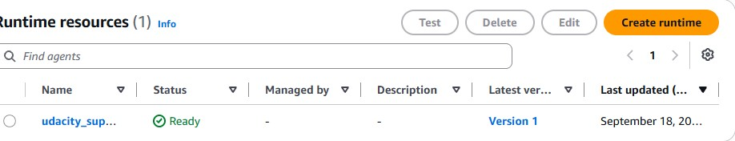
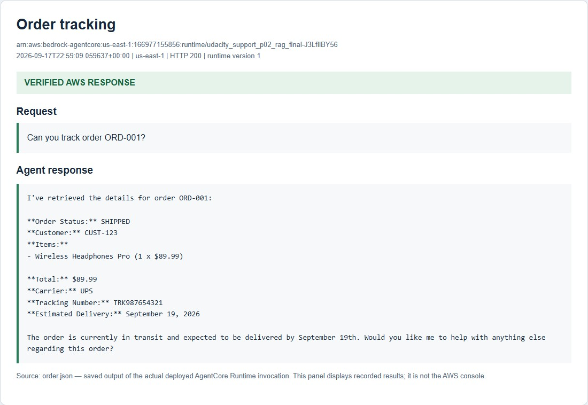
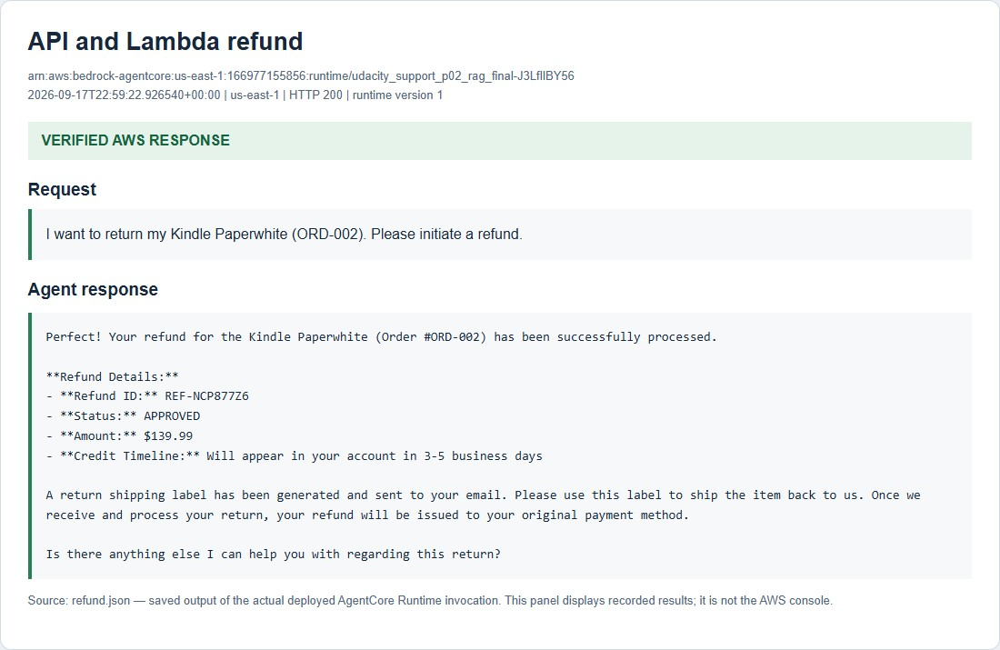
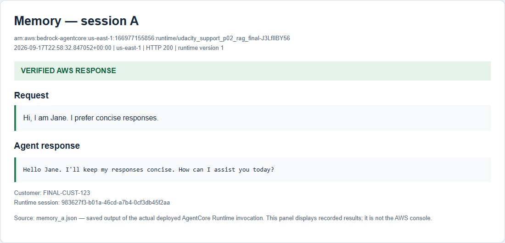
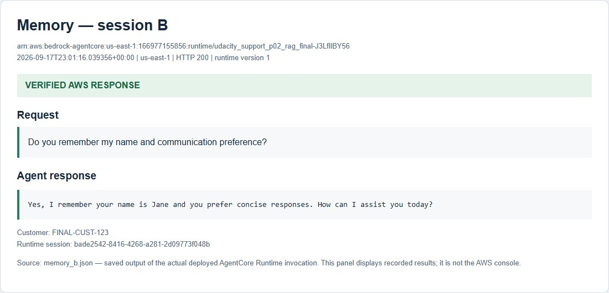
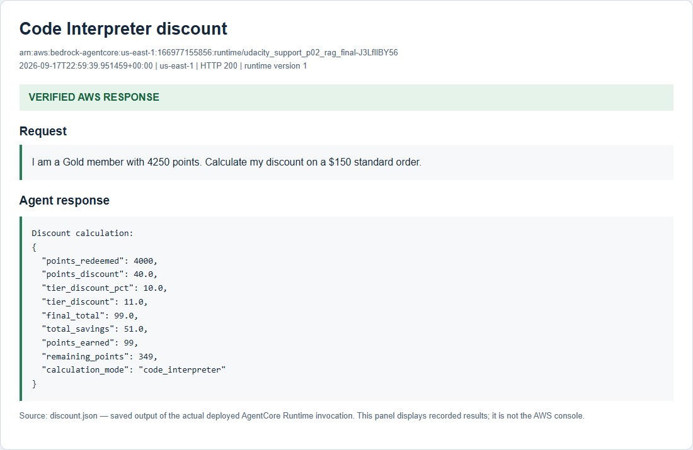
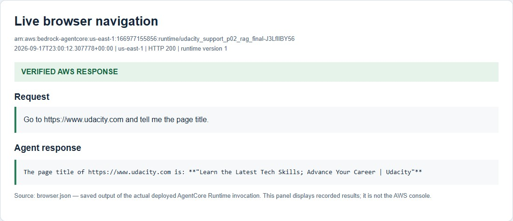

# Test Evidence

[Project overview](README.md) · [AWS architecture](AWS_ARCHITECTURE.md)

All six required scenarios passed on September 18, 2026, India time. The UTC
records are dated September 17. Each positive test used version 1 of the same
deployed runtime in `us-east-1`; the JSON files retain requests, responses, and
tool conversations.

The screenshots below are cursor-free panels displaying saved runtime results.
The runtime status image is an AWS console crop. They document the completed
deployment run; the test resources have since been removed.

## Deployment evidence

The [uploaded-source check](submission/outputs/source_verification.json) confirms
that the deployed `main.py` matches the repository. Actual `agentcore invoke`
output is available for [orders](submission/outputs/agentcore_invoke.txt) and
[RAG](submission/outputs/agentcore_rag.txt), with
[order metadata](submission/outputs/agentcore_invoke.json) and
[RAG metadata](submission/outputs/agentcore_rag.json) recording exit code 0.

## Test 1 — Order tracking

**Request:** Track `ORD-001`.

**Result:** The API-backed Gateway tool returned SHIPPED status, carrier UPS,
tracking number `TRK987654321`, and an estimated delivery date of September 19.
[Full conversation](submission/outputs/order.json).

## Test 2 — Refund processing

**Request:** Return the Kindle Paperwhite on `ORD-002`.

**Result:** The conversation successfully invoked the API-backed order lookup and
the direct Lambda refund tool. Both returned nonempty JSON. The refund fixture
returned `REF-NCP877Z6`, APPROVED status, $139.99, and a 3–5 business day timeline.
[Full conversation](submission/outputs/refund.json).

## Test 3 — Knowledge Base retrieval

**Request:** Explain Platinum loyalty benefits.

**Result:** The Knowledge Base tool retrieved free same-day shipping, a 15%
purchase discount, and priority support. The record contains the retrieval tool
response used for the answer. [Full conversation](submission/outputs/rag.json).

## Test 4 — Cross-session memory

**Session A:** Jane introduces herself and asks for concise responses.
[Introduction record](submission/outputs/memory_a.json).

**Session B:** A separate session for the same customer recalls Jane and her
communication preference. The record includes retrieved context tagged by memory
strategy. [Recall record](submission/outputs/memory_b.json).

The course requests a wait of at least 30 seconds between sessions. Extraction
and indexing may take longer. The [initial recall attempt](submission/outputs/memory_b_initial.json)
did not retrieve the context; the final attempt above succeeded.

## Test 5 — Loyalty discount

**Request:** Calculate a Gold member's discount for 4,250 points and a $150
standard order.

**Result:** Code Interpreter redeemed 4,000 points for $40, then applied a 10%
Gold discount to the $110 balance. The final total was $99. The remaining balance
was 349 points: 250 unredeemed points plus 99 newly earned points. The final
response preserved the validated calculator output.
[Full conversation](submission/outputs/discount.json).

## Test 6 — Live browser

**Request:** Open `https://www.udacity.com` and report its title, following the
URL in the course command.

**Result:** AgentCore Browser retrieved
“Learn the Latest Tech Skills; Advance Your Career | Udacity”. The tool recovered
from one invalid session name before completing navigation; that attempt remains
in the record. [Full conversation](submission/outputs/browser.json).

## Reviewer correction checks

| Check | Deployed result | Record |
| --- | --- | --- |
| Empty Knowledge Base ID | Descriptive setup message preserved in the final response | [KB guard](submission/outputs/rag_guard.json) |
| Closed dummy Gateway endpoint | `GATEWAY_UNAVAILABLE` with retry and administrator guidance | [Gateway failure](submission/outputs/gateway_failure.json) |
| Gateway diagnostics | Discovery success and connection failure recorded in CloudWatch | [Runtime logs](submission/outputs/runtime_logs.json) |

## Rubric coverage

| Criterion | Implementation and evidence |
| --- | --- |
| Cloud runtime | Module-level app, asynchronous decorated entrypoint, `app.run()`, and successful CLI output |
| MCP integration | Gateway discovery and valid API/Lambda tool responses in Test 2 |
| RAG | Decorated Retrieve tool, joined chunks, usage docstring, Test 3, and the empty-KB check |
| Memory | Namespace compatibility, registered retrieval/persistence hooks, and both Test 4 sessions |
| Code Interpreter | Complete sandbox program, cleared context, structured fields, tier-only fallback, and Test 5 |
| Browser | Region-configured browser tool and live content in Test 6 |
| Reflection | [243-word reflection](REFLECTION.md) covering a design decision, a challenge, and production controls |

## Submission and cleanup

The course submission includes completed [main.py](main.py), the six test outputs
with both memory sessions, and [REFLECTION.md](REFLECTION.md). The supplied
Lambda files and catalog support reproduction of the setup.

The complete run used the authorized personal account after sandbox vector-store
permissions blocked RAG setup. [Cleanup checks](submission/outputs/cleanup_verification.json)
record 20 resources/log groups absent. Udacity re-review remains pending; the
revised package has not been uploaded to the portal.
