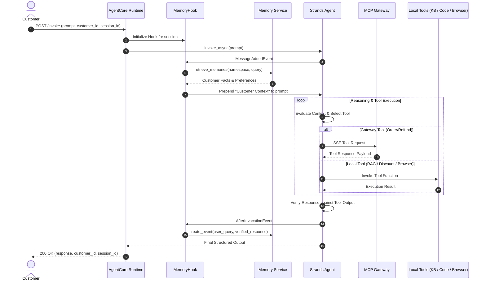

# System Architecture & Technical Specifications

This document outlines the design, component interactions, and data flow of the **AI Support Agent** platform built with the **Strands SDK** and **Amazon Bedrock AgentCore Runtime**.

---

## 1. High-Level System Architecture

```mermaid
flowchart TD
    Client["Client / API Gateway Request"] --> Runtime["Bedrock AgentCore Runtime"]

    subgraph AgentCoreRuntime["AgentCore Runtime Execution Environment"]
        Runtime --> AppHandler["App Entrypoint (`invoke`)"]
        AppHandler --> Agent["Strands Agent (`BedrockModel: Nova 2 Lite`)"]
        
        subgraph LifecycleHooks["Lifecycle Hooks"]
            MemHook["`MemoryHook` (HookProvider)"]
            MemHook -.->|MessageAddedEvent| MemRetrieve["Retrieve Customer Context"]
            MemHook -.->|AfterInvocationEvent| MemPersist["Persist Customer Facts & Preferences"]
        end
        Agent <--> LifecycleHooks
    end

    subgraph ToolsFederation["Federated Tool Ecosystem"]
        Agent -->|"MCP Streamable HTTP / SSE"| Gateway["AgentCore Gateway"]
        Gateway -->|"REST Integration"| LambdaOrder["`order_tracker` Lambda"]
        Gateway -->|"Direct Tool Lambda"| LambdaRefund["`refund_processor` Lambda"]

        Agent -->|"boto3: retrieve()"| BedrockKB["Bedrock Knowledge Base<br/>(OpenSearch Serverless Vector Index)"]
        Agent -->|"code_session"| CodeSandbox["AgentCore Code Interpreter<br/>(Sandboxed Python)"]
        Agent -->|"CDP / Chromium"| BrowserSandbox["AgentCore Browser<br/>(Playwright Driver)"]
    end

    subgraph PersistenceStore["Long-Term State Store"]
        MemRetrieve <--> AgentMemory["Bedrock AgentCore Memory Service<br/>(DynamoDB Backend)"]
        MemPersist --> AgentMemory
    end

    subgraph Observability["Telemetry & Diagnostics"]
        Runtime -.-> CloudWatchLogs["Amazon CloudWatch Logs"]
        Runtime -.-> CloudWatchAlarms["CloudWatch Error Alarms"]
    end
```

---

## 2. Component Specifications

### 2.1 Agent Reasoning Core
- **Orchestration Framework**: Strands SDK (`Agent`, `@tool`, `HookProvider`).
- **Foundation Model**: Amazon Nova 2 Lite (`global.amazon.nova-2-lite-v1:0`), initialized with low sampling temperature (`0.1`) to ensure deterministic tool selection and argument generation.
- **System Prompt Governance**: Injects strict data isolation rules preventing prompt injection from untrusted web or catalog sources, requiring factual verification before issuing refunds.

### 2.2 Model Context Protocol (MCP) Gateway
External order and refund microservices are federated into the agent via **Model Context Protocol (MCP)** using the `streamable_http_client` over Server-Sent Events (SSE).
- **Order Tracker (`order_tracker.py`)**: Handles customer identity verification and purchase lookup. Implemented as an Amazon API Gateway REST API proxy.
- **Refund Processor (`refund_processor.py`)**: Executes stateful refund transactions and return label generation. Strips the Gateway tool namespace prefix (`TargetName___toolName`) and dispatches directly.

### 2.3 Knowledge Base Retrieval (RAG Pipeline)
- **Vector Storage**: Amazon OpenSearch Serverless collection using hierarchical vector index mappings.
- **Embedding Model**: Amazon Titan Text Embeddings v2 (`amazon.titan-embed-text-v2:0`).
- **Retrieval Engine**: Invoked synchronously via Bedrock Agent Runtime's `retrieve` API. Returned text chunks are cleaned, ranked, and joined with delimiter boundaries (`---`).

### 2.4 Customer Memory Lifecycle
State is maintained across distinct interaction sessions via an event-driven `MemoryHook`:
1. **Turn Start (`MessageAddedEvent`)**: Queries the customer's namespace using the `retrieve_memories` API. Injects formatted semantic facts and communication preferences directly into the user message context.
2. **Turn Completion (`AfterInvocationEvent`)**: Captures the raw user query and the verified assistant response, committing the turn to `create_event` asynchronously.

### 2.5 Sandboxed Code Interpreter
Financial loyalty calculations (points conversion, redemption limits, order discount deductions) are delegated to a transient Python runtime in AgentCore Code Interpreter. This isolates financial arithmetic from the stochastic behavior of LLMs.

### 2.6 Headless Browser Automation
The agent uses `AgentCoreBrowser` to navigate live external web URLs, inspect DOM trees, and extract target element text without manual browser setup.

---

## 3. Request Lifecycle Sequence


