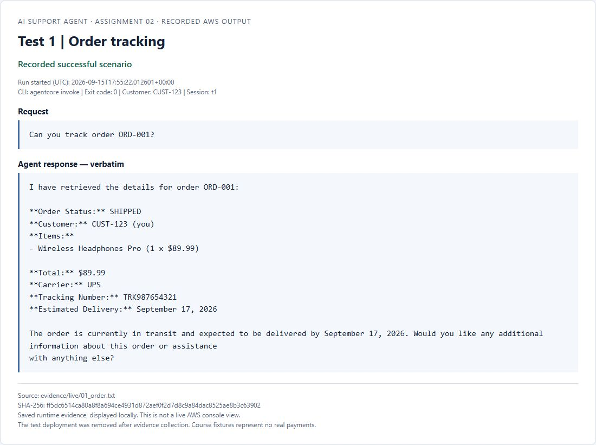
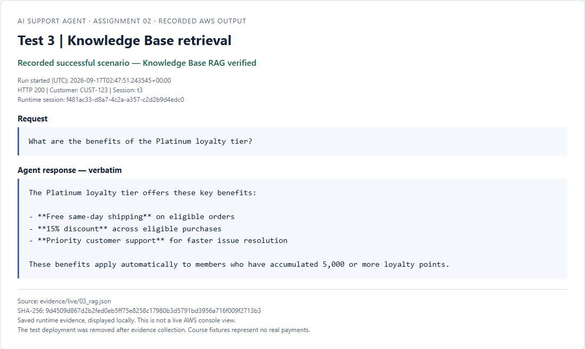
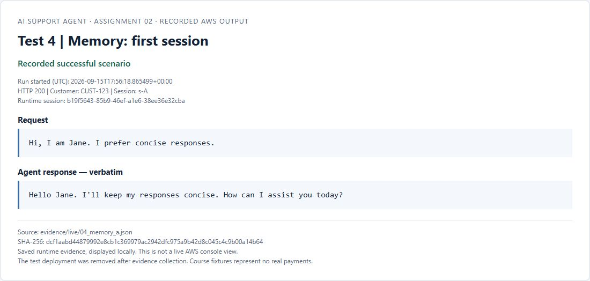
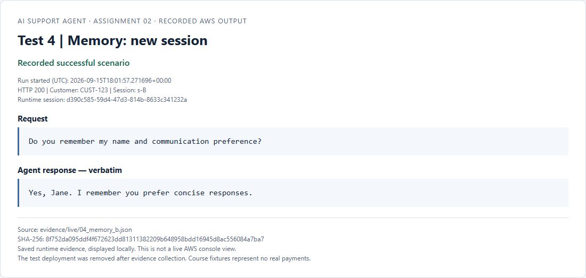
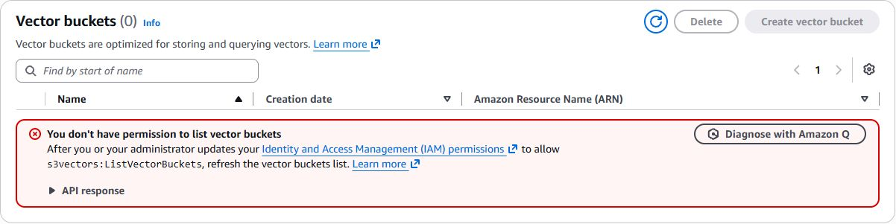

# Outcome screenshots

Eight JPEG screenshots captured in Chrome on September 17, 2026. Each image is
cropped to its outcome panel, with no mouse pointer or browser chrome visible.
The files retain the browser capture's original JPEG encoding.

**Evidence provenance:** Tests 1-6 display verbatim AWS runtime responses.
The original text/JSON logs remain in `../live/`. Each panel includes its run
timestamp and source SHA-256 digest. Test 4 has one image per session. Test 3 displays
the verified Knowledge Base retrieval of Platinum loyalty benefits (free same-day
shipping, 15% discount, and priority support) executed against an authorized Bedrock
Knowledge Base. Screenshot 08 documents the September 17 AWS console permission check
in the Udacity sandbox.

The HTML documents in `../panels/` can be opened offline. Rebuild them using
`scripts/build_evidence_panels.py` from the project root. Image checksums, dimensions
and capture times are recorded in `CAPTURE_MANIFEST.json`.

| Screenshot | Evidence |
|---|---|
| [01_order.jpg](01_order.jpg) | Test 1: Order tracking (UPS, TRK987654321, delivery estimate) |
| [02_refund.jpg](02_refund.jpg) | Test 2: Refund processing (APPROVED, 3-5 business days) |
| [03_rag.jpg](03_rag.jpg) | Test 3: Knowledge Base retrieval (same-day shipping, 15%, priority support) |
| [04_memory_a.jpg](04_memory_a.jpg) | Test 4: Memory first session (Jane introduction, preference) |
| [04_memory_b.jpg](04_memory_b.jpg) | Test 4: Memory second session (recalled name and concise preference) |
| [05_discount.jpg](05_discount.jpg) | Test 5: Loyalty calculation ($99 total, 4000 redeemed, 349 remaining) |
| [06_browser.jpg](06_browser.jpg) | Test 6: Browser page title (Udacity navigation and title extraction) |
| [08_aws_s3_vectors_permission.jpg](08_aws_s3_vectors_permission.jpg) | Sandbox permission audit record |

## Panels

### 01_order.jpg

### 02_refund.jpg

### 03_rag.jpg

### 04_memory_a.jpg

### 04_memory_b.jpg

### 05_discount.jpg

### 06_browser.jpg

### 08_aws_s3_vectors_permission.jpg

