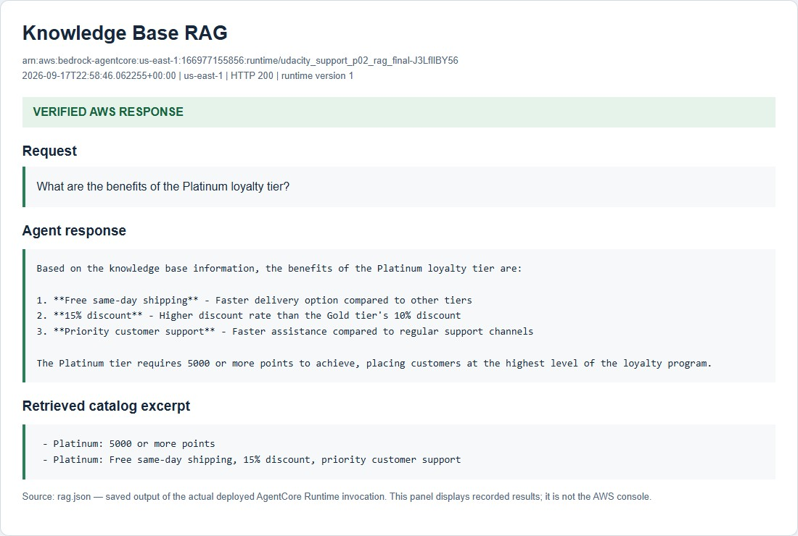

# Complete deployed-agent verification

Run date: **September 18, 2026, India time** (September 17 in the UTC records).
Account: user-authorized personal AWS account `166977155856`.
Region: `us-east-1`.
Runtime: `udacity_support_p02_rag_final-J3LfIlBY56`.

The final recorded-response audit reports **6/6 required scenarios passed**,
all reviewer corrections passed, and `submission_ready: true` for its technical
checks. This is measured deployment evidence, not a Udacity acceptance decision.
The revised package has not been uploaded for re-review.

| Required test | Measured result | Record | Outcome screenshot |
| --- | --- | --- | --- |
| Order tracking | SHIPPED, UPS, TRK987654321, September 19 ETA | [order.json](order.json) | [Panel](order_outcome.jpg) |
| API and Lambda refund | Valid JSON from both targets, APPROVED, $139.99, 3-5 business days | [refund.json](refund.json) | [Panel](refund_outcome.jpg) |
| Knowledge retrieval | Retrieved Platinum same-day shipping, 15% discount and priority support | [rag.json](rag.json) | [Panel](rag_outcome.jpg) |
| Cross-session memory | Same customer, distinct sessions; recalls Jane and concise responses | [Session A](memory_a.json), [session B](memory_b.json) | [A](memory_a_outcome.jpg), [B](memory_b_outcome.jpg) |
| Code Interpreter | 4,000 points redeemed, 10% tier rate, $99 final total, 349 points remaining | [discount.json](discount.json) | [Panel](discount_outcome.jpg) |
| Browser | Actual navigation and live Udacity page title | [browser.json](browser.json) | [Panel](browser_outcome.jpg) |

All six positive scenarios used version 1 of the **same** deployed runtime.
[source_verification.json](source_verification.json) checks the actual uploaded
ZIP, records all four deployment settings, and confirms that `main.py` matches
the repository byte for byte. The original Lambda files remain unchanged.

## CLI and reviewer corrections

- [Order CLI output](agentcore_invoke.txt) and [metadata](agentcore_invoke.json):
  actual `agentcore invoke`, exit code 0, same runtime and uploaded source hash.
- [RAG CLI output](agentcore_rag.txt) and [metadata](agentcore_rag.json):
  actual Platinum query, exit code 0 and all three expected benefits.
- [Empty-KB guard](rag_guard.json): version 2 overrides `KB_ID` with an empty
  value and returns the descriptive configuration message.
- [Dummy Gateway](gateway_failure.json): version 3 overrides the endpoint with a
  closed localhost URL and returns `GATEWAY_UNAVAILABLE`, retry instructions and
  administrator guidance.
- [CloudWatch logs](runtime_logs.json): Gateway success/failure and Memory event
  persistence are recorded. Version 4 restores the valid settings before cleanup.

Memory extraction and search indexing are asynchronous. The initial unsuccessful
recall is preserved in [memory_b_initial.json](memory_b_initial.json); the final
recall includes the retrieved, strategy-tagged customer context. The browser
recovered from one invalid underscore-containing session name before successfully
reading the live title. These intermediate failures are disclosed and preserved.

## RAG provisioning and account choice

The Udacity sandbox still denies `aoss:CreateSecurityPolicy`. The user explicitly
authorized their personal account and signed in for this complete test run.
No sandbox IAM policy was changed. Using the personal account is a disclosed
departure from the classroom's sandbox setup instruction.

The custom index request initially omitted the required payload-hash header,
causing HTTP 403. The corrected request signs the exact JSON bytes and their
`x-amz-content-sha256` hash. [Diagnostics](provisioning_diagnostics.json),
[live helper check](index_creation.json), [Retrieve health check](retrieve_healthcheck.json)
and [ingestion details](infrastructure.json) document the result. The reusable
[index helper](../../scripts/create_catalog_index.py) uses the normal AWS
credential chain. Catalog sync completed with no failed documents.

## Cleanup and reproducibility

[Deletion requests](cleanup.json) and [independent checks](cleanup_verification.json)
verify all 20 resources/log groups absent. The exact test Browser session was
[stopped and verified TERMINATED](browser_cleanup.json).
The Knowledge Base deletion initially could not reach the already deleted vector
collection. [The retry](cleanup_retry.json) changed the data-source deletion
policy to RETAIN for that absent collection, then removed the remaining metadata.
The final check confirms both the collection and Knowledge Base are absent;
no vector data remains.

These identifiers are historical test identifiers. The packaged `config.json`
is a blank template; create new resources and provide their actual settings
before redeploying. Credential files and deployment scratch directories are
excluded from the package and GitHub repository.

```powershell
python -m pytest tests -q
python scripts/verify_cloud_revision.py
python scripts/render_cloud_outcomes.py
python scripts/package_revision.py
```

The checker reads saved AWS records; it does not invoke AWS. The renderer creates
HTML panels directly from the verified responses. Their screenshots contain
only the outcome panel, with no cursor. [runtime_ready.jpg](runtime_ready.jpg)
is a real AWS console crop; the other panels are clearly labeled saved-result
viewers. [local_tests.json](local_tests.json) records 33 passed tests and one
upstream deprecation warning. See the [rubric checklist](../../docs/submission_checklist.md)
for the complete criterion mapping.


