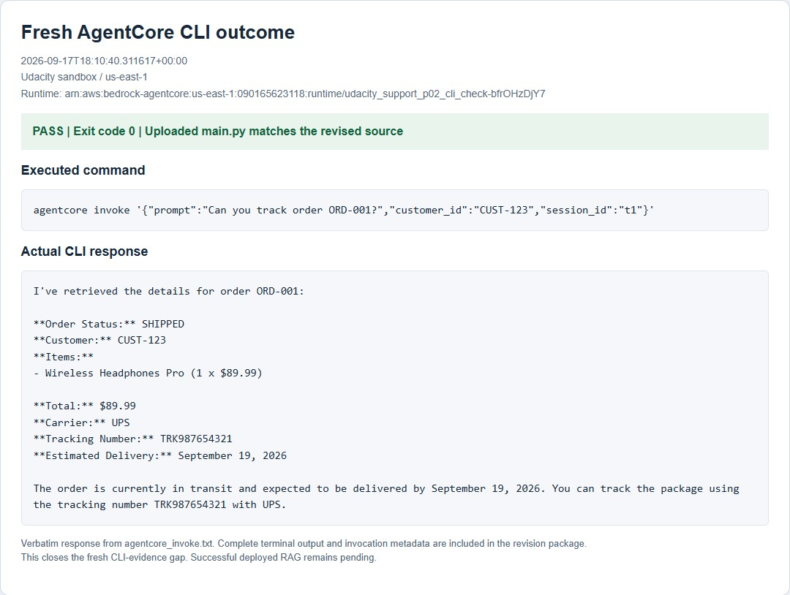

# Fresh AWS deployment verification

Run date: September 17, 2026. Account: Udacity sandbox `090165623118`.
Region: `us-east-1`. Runtime: `udacity_support_p02_rev2-uE9Qrh46hn`.

The uploaded source matches the revised `main.py` byte for byte. The records
contain actual AgentCore Runtime invocation responses, runtime versions, unique
session IDs, timestamps and tool messages.

| Check | Result | Evidence |
| --- | --- | --- |
| Order tracking | Passed; UPS tracking returned | `order.json` |
| Refund | Passed; API order lookup and Lambda refund return valid JSON | `refund.json` |
| Successful RAG | Blocked by sandbox OpenSearch permissions | `rag_permission.json` |
| Memory | Passed in a new session after extraction became available | `memory_a.json`, `memory_b.json` |
| Discount | Passed; Code Interpreter, $99 total, 349 points | `discount.json` |
| Browser | Passed after recovering from one invalid session name | `browser.json` |
| Missing KB guard | Passed; descriptive configuration response | `rag.json` |
| Dummy Gateway | Passed; `GATEWAY_UNAVAILABLE`, retry and administrator guidance | `gateway_failure.json` |
| Gateway logging | Passed; success and intentional failure in CloudWatch | `runtime_logs.json` |

Version 1 used the valid Gateway and empty KB setting. Version 2 deliberately
overrode the Gateway with a closed localhost endpoint. Version 3 restored the
valid Gateway and verified final memory recall. All three used the same source
artifact. `memory_b_initial.json` preserves an unsuccessful early recall.

`verification.json` reports **5/6 scenarios passed**, both reviewer corrections
verified in AWS, and `submission_ready: false`. Run
`python scripts/verify_cloud_revision.py` to independently check these saved
records. This command does not create a deployment or perform new invocations.

`runtime_ready.jpg` is a cursor-free crop of the AWS console panel.
`cloud_outcomes.jpg` shows measured cloud outputs from the saved response files.
The temporary test resources were removed after capture; cleanup requests and
independent absence checks are recorded alongside the results.

Successful RAG through the revised deployed runtime is the remaining live check.
The sandbox denied `aoss:CreateSecurityPolicy`; personal-account authentication
must be restored to use the already authorized alternative.

## Fresh CLI check after rubric re-review

`agentcore_invoke.txt` is verbatim output from the course order-tracking command
executed through `agentcore invoke` in a separate temporary sandbox runtime.
`agentcore_invoke.json` records its timestamp, runtime ARN, exit code 0, expected
UPS tracking details, and an uploaded-source hash matching the revised agent.
The separate runtime makes the CLI check independently identifiable without
changing the original fresh scenario records. Its resource deletion requests
and independent cleanup checks are in `cli_cleanup*.json`.

[The rubric checklist](../../docs/submission_checklist.md) maps every criterion
to its implementation and evidence. Successful deployed RAG remains pending.
